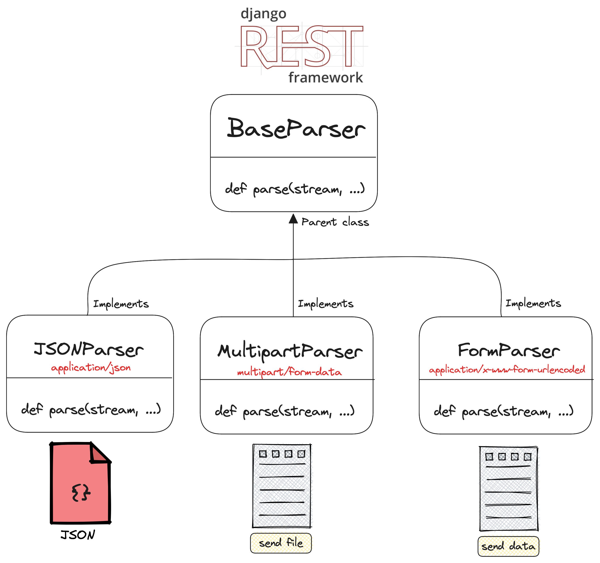

# Creational design patterns

Creational design pattern are related to creation of a class in particular situation. 
They allow you to control object creation.


## Abstract Factory


## Factory Method
Factory method allows to decide which concrete implementation of a class should be created based on some parameters.

Django rest framework implements several types of incoming request parsers. 
Incoming requests could be represented as json string, multipart data, as files and so on. Data type is called media type(`application/json`, `multipart/form-data`)
To handle all the required types of incoming media(json, forms, files, etc) we have a base class called `BaseParser`.

https://github.com/encode/django-rest-framework/blob/7658ffd71d4ad07ddada20b2b9538b889ec02403/rest_framework/parsers.py#L32

```python
class BaseParser:
    """
    All parsers should extend `BaseParser`, specifying a `media_type`
    attribute, and overriding the `.parse()` method.
    """
    media_type = None

    def parse(self, stream, media_type=None, parser_context=None):
        """
        Given a stream to read from, return the parsed representation.
        Should return parsed data, or a `DataAndFiles` object consisting of the
        parsed data and files.
        """
        raise NotImplementedError(".parse() must be overridden.")
```


All parsers inherit base parser class and implement their parsing logic.

For incoming request in json format we have `JSONParser`.

```python

class JSONParser(BaseParser):
    """
    Parses JSON-serialized data.
    """
    media_type = 'application/json'

    def parse(self, stream, media_type=None, parser_context=None):
        """
        Parses the incoming bytestream as JSON and returns the resulting data.
        """
        ...
```

For incoming request as url encoded form we have `FormParser`.


```python

class FormParser(BaseParser):
    """
    Parser for form data.
    """
    media_type = 'application/x-www-form-urlencoded'

    def parse(self, stream, media_type=None, parser_context=None):
        """
        Parses the incoming bytestream as a URL encoded form,
        and returns the resulting QueryDict.
        """
        ...
    
```




To decide which parser class instance to create we have another method called `select_parser`.
It chooses what type of parser we should use. 
This is an example of `factory method` usage in real life. 

https://github.com/encode/django-rest-framework/blob/7658ffd71d4ad07ddada20b2b9538b889ec02403/rest_framework/negotiation.py#L25


```python

    def select_parser(self, request, parsers):
        """
        Given a list of parsers and a media type, return the appropriate
        parser to handle the incoming request.
        """
        for parser in parsers:
            if media_type_matches(parser.media_type, request.content_type):
                return parser
        return None

```


## Singleton